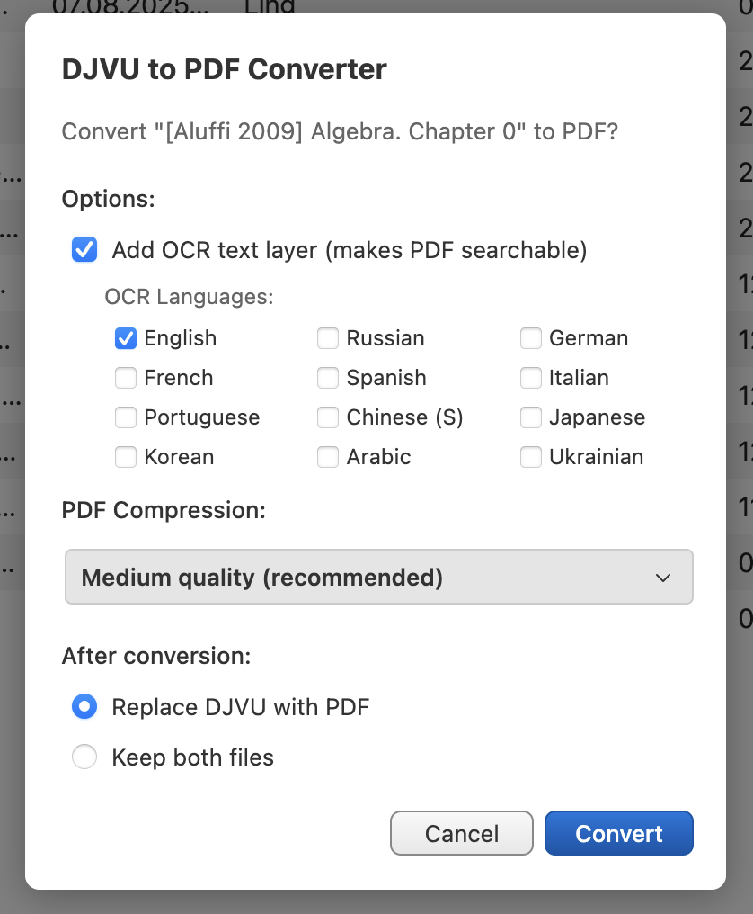

# DJVU to PDF Converter for Zotero

A Zotero 7/8 plugin that converts DJVU files to PDF with optional OCR and compression.

<p align="center">
  
</p>

## Features

- **Cross-Platform**: Works on macOS, Linux, and Windows
- **Automatic Detection**: Prompts to convert when DJVU files are added to your library
- **Manual Conversion**: Right-click context menu for converting DJVU files
- **OCR Support**: Add searchable text layer to PDFs (supports 12 languages)
- **PDF Compression**: Reduce file size using ocrmypdf optimization
- **Flexible Options**: Choose to replace original or keep both files
- **Progress Tracking**: Visual progress with cancel button
- **Size Reporting**: Shows file size at each conversion stage
- **Batch Processing**: Queue system for processing multiple files sequentially
- **Smart Auto-detect**: Debounced detection batches multiple files added together

## Requirements

### Zotero
- Zotero 7.0 or later

### External Dependencies

#### macOS (Homebrew)

```bash
# Required for DJVU conversion
brew install djvulibre

# Required for OCR and PDF compression
brew install ocrmypdf tesseract tesseract-lang
```

#### Linux (Debian/Ubuntu)

```bash
# Required for DJVU conversion
sudo apt install djvulibre-bin

# Required for OCR and PDF compression
sudo apt install ocrmypdf tesseract-ocr tesseract-ocr-eng
```

#### Linux (Fedora/RHEL)

```bash
# Required for DJVU conversion
sudo dnf install djvulibre

# Required for OCR and PDF compression
sudo dnf install ocrmypdf tesseract tesseract-langpack-eng
```

#### Windows

Using [Chocolatey](https://chocolatey.org/):

```powershell
# Required for DJVU conversion
choco install djvulibre

# Required for OCR and PDF compression
choco install tesseract
pip install ocrmypdf
```

Alternatively, download installers from:
- [DjVuLibre](http://djvu.sourceforge.net/djvulibre-windows.html)
- [Tesseract](https://github.com/UB-Mannheim/tesseract/wiki)
- [OCRmyPDF](https://ocrmypdf.readthedocs.io/en/latest/installation.html)

## Installation

1. Download the latest `.xpi` file from [Releases](https://github.com/ievlevpn/zotero-djvu-converter/releases)
2. Open Zotero
3. Go to **Tools** → **Add-ons**
4. Click the gear icon → **Install Add-on From File**
5. Select the downloaded `.xpi` file
6. Restart Zotero

## Usage

### Automatic Conversion
When you add a DJVU file to Zotero, the plugin will automatically prompt you with conversion options.

### Manual Conversion (Context Menu)
Right-click on items in your library to access:

- **Convert DJVU to PDF...** - Convert selected DJVU files
- **Add OCR Layer to PDF...** - Add searchable text to existing PDFs
- **Compress PDF...** - Reduce PDF file size

### Conversion Options

| Option | Description |
|--------|-------------|
| Add OCR text layer | Makes the PDF searchable (requires ocrmypdf + tesseract) |
| OCR Languages | Select one or more languages for OCR |
| Compress PDF | Reduces file size (requires ocrmypdf) |
| Replace DJVU with PDF | Removes original DJVU after conversion |
| Keep both files | Adds PDF as sibling attachment |

### Supported OCR Languages

English, Russian, German, French, Spanish, Italian, Portuguese, Chinese (Simplified), Japanese, Korean, Arabic, Ukrainian

Additional language packs can be installed via `brew install tesseract-lang`.

## Building from Source

```bash
# Clone the repository
git clone https://github.com/ievlevpn/zotero-djvu-converter.git
cd zotero-djvu-converter

# Build the plugin
bash build.sh

# Output: build/djvu-converter-1.6.0.xpi
```

## Project Structure

```
zotero-djvu-converter/
├── manifest.json      # Plugin metadata
├── bootstrap.js       # Plugin lifecycle hooks
├── src/
│   └── djvu-converter.js  # Main plugin logic
├── icons/
│   ├── icon48.png
│   └── icon96.png
├── build.sh           # Build script
└── README.md
```

## Troubleshooting

### "ddjvu not found" error
Install djvulibre:
- **macOS**: `brew install djvulibre`
- **Linux**: `sudo apt install djvulibre-bin`
- **Windows**: `choco install djvulibre`

### "ocrmypdf not found" error
Install OCR dependencies:
- **macOS**: `brew install ocrmypdf tesseract tesseract-lang`
- **Linux**: `sudo apt install ocrmypdf tesseract-ocr`
- **Windows**: `choco install tesseract` and `pip install ocrmypdf`

### OCR is slow
OCR processing time depends on file size and page count. Large files may take several minutes. You can cancel the operation using the Cancel button.

### OCR fails with language error
Make sure the required language pack is installed:
- **macOS**: `brew install tesseract-lang`
- **Linux**: `sudo apt install tesseract-ocr-<lang>` (e.g., `tesseract-ocr-deu` for German)
- **Windows**: Download language packs from [Tesseract GitHub](https://github.com/tesseract-ocr/tessdata)

## Changelog

### v1.6.0
- **Queue System**: Operations now queue sequentially with "Cancel All" support
- **Batch Auto-convert**: Multiple DJVU files added together are batched (200ms debounce)
- **Progress Fixes**: No more [1/1] for single files, immediate close on cancel
- **Stability**: Orphaned temp file cleanup, better error handling in notifier
- **Edge Cases**: Prevent duplicate operations on same file

### v1.5.x
- Non-blocking progress dialog
- Batch processing for manual operations
- Process cleanup on cancel
- Compression safeguards

### v1.4.x
- Code refactoring
- Ghostscript removal (using ocrmypdf for compression)

### v1.3.0
- Page-by-page progress display
- Bug fixes for cancellation

### v1.2.0
- PDF compression feature
- Multiple language OCR support

### v1.1.0
- OCR support with tesseract
- Context menu integration

### v1.0.0
- Initial release
- DJVU to PDF conversion

## License

MIT License - see [LICENSE](LICENSE) file.

## Author

[ievlevpn](https://github.com/ievlevpn)

## Acknowledgments

- [DjVuLibre](http://djvu.sourceforge.net/) - DJVU tools
- [OCRmyPDF](https://ocrmypdf.readthedocs.io/) - OCR and PDF optimization
- [Tesseract](https://github.com/tesseract-ocr/tesseract) - OCR engine
